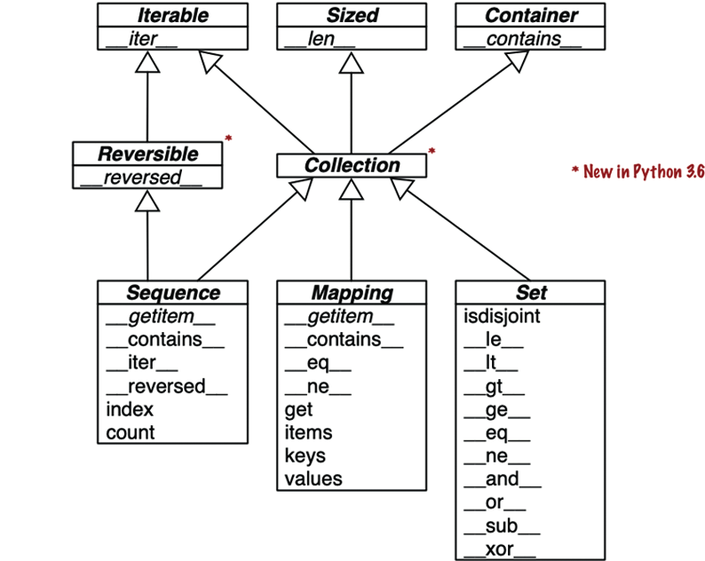

## Інтерфейси колекцій в Python

:   Самі важливі інтерфейси колекцій в Python і  як вони будуються за допомогою спеціальних методів.

!!! info "UML-діаграма класів, що ілюструє найважливіші типи колекцій"
    Методи, імена яких набрані курсивом, абстрактні, тому мають бути реалізовані у конкретних підкласах, наприклад list та dict. Інші методи мають конкретні реалізації, які підкласи можуть успадкувати.

## Абстрактний базовий клас Collection
:   У кожного з ABC у верхньому ряду є лише один спеціальний метод
    Абстрактний базовий клас Collection уніфікує всі три основні інтерфейси, які має реалізувати будь-яка колекція:

    - Iterable для підтримки `for`, розпакування та інших видів ітерування;
    - Sized для підтримки вбудованої функції `len`;
    - Container для підтримки оператора `in`.

Python не вимагає, щоб конкретні класи успадкували одному з цих ABC. Будь-який клас, що реалізує метод `__len__`, відповідає вимогам інтерфейсу Sized.

## Три найважливіші спеціалізації Collection

1. Sequence, формалізує інтерфейс вбудованих класів, зокрема list та str;
2. Mapping, реалізований класами dict, collections.defaultdict та ін;
3. Set, інтерфейс вбудованих типів set і frozenset.

## Sequence та Reversible

Тільки Sequence реалізує інтерфейс Reversible, тому що послідовності підтримують довільне впорядкування елементів, тоді як Mapping та Set таку властивістю не мають.

!!! warning "Уага"
    Починаючи з версії Python 3.7, тип dict офіційно вважається "упорядкованим", але це лише означає, що порядок вставки ключів зберігається. Переупорядкувати ключі словника dict так, як вам хочеться, неможливо.

## Set

:   Усі спеціальні методи ABC Set призначені реалізації інфіксних операторів. Наприклад, вираз `a & b` обчислює перетин множин `a` та `b` і реалізовано спеціальним методом `__and__`.
